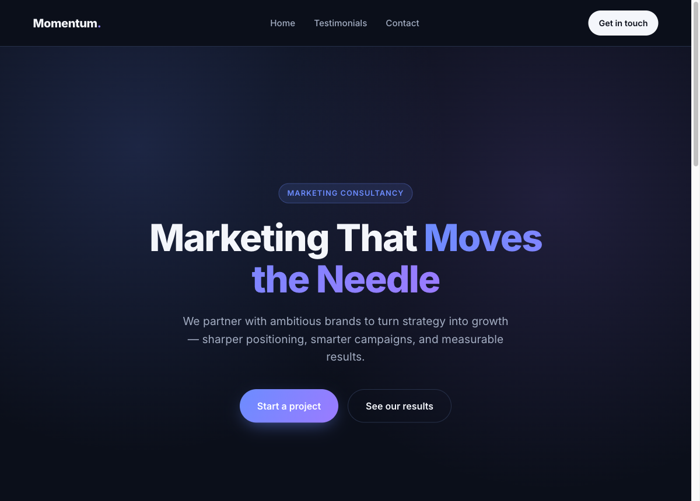

# Momentum Marketing Consultancy — Website

A single-page marketing consultancy website built with vanilla HTML, CSS, and JavaScript — no frameworks or external dependencies (aside from an optional Google Font).

**Live site:** https://ongkianhan.github.io/claude-code-jul-25-2026/



## About

This is a landing page for a fictional marketing consultancy ("Momentum") designed to showcase the firm's value proposition, build trust through client testimonials, and convert visitors into leads via a contact form.

## Structure

The project is split into three files:

| File | Purpose |
|---|---|
| [index.html](index.html) | Page markup |
| [styles.css](styles.css) | All styling |
| [script.js](script.js) | Smooth scrolling + enquiry form logic |

The page is one continuous scroll with a sticky nav linking to three sections:

| Section | Anchor | Purpose |
|---|---|---|
| **Home** | `#home` | Hero section with headline, subheadline, and CTA buttons |
| **Testimonials** | `#testimonials` | Social proof from three clients |
| **Contact** | `#contact` | Enquiry form for lead generation |

## Functionality

- **Sticky nav bar** — stays pinned to the top while scrolling, with anchor links to each section and a "Get in touch" CTA.
- **Smooth scrolling** — all in-page anchor links (`href="#..."`) smooth-scroll to their target section via JS (`scrollIntoView`).
- **Hero section** — full-viewport-height intro with a gradient/accent background, bold headline, supporting copy, and two CTAs ("Start a project" scrolls to the form, "See our results" scrolls to testimonials).
- **Testimonial cards** — a responsive 3-column grid (collapses to a single column on mobile) with a quote, client name, role/company, and an initials-based avatar placeholder. Cards lift on hover.
- **Enquiry form** — collects Name, Email, Company (optional), and Message.
  - **Client-side validation**: required fields (Name, Email, Message) and email format checking via regex, with inline error messages and highlighted invalid fields.
  - **Submission handling**: on submit, the form is posted as JSON to a [Formspree](https://formspree.io/) endpoint via `fetch()`. The button shows a "Sending…" state while the request is in flight, then displays a success message on a `200` response or an inline error message on failure.
  - **Formspree endpoint placeholder**: `FORMSPREE_ENDPOINT` in [script.js](script.js) is set to `https://formspree.io/f/{YOUR_FORM_ID}` — replace `{YOUR_FORM_ID}` with a real Formspree form ID before the form can actually deliver submissions.

## Design

- Dark, modern aesthetic with a blue-to-purple gradient accent (`--accent` / `--accent-2`).
- Typography via the Inter font (Google Fonts).
- Mobile-first, fully responsive layout using CSS Grid and Flexbox with breakpoints at `860px` and `480px`.

## Running locally

No build step required — just open [index.html](index.html) directly in a browser, or serve it with any static file server:

```bash
python3 -m http.server 8000
```

## Deployment

Every push to `main` triggers [.github/workflows/deploy.yml](.github/workflows/deploy.yml), which publishes the site to GitHub Pages at https://ongkianhan.github.io/claude-code-jul-25-2026/.

## To do before going live

- Replace `{YOUR_FORM_ID}` in the `FORMSPREE_ENDPOINT` constant with a real Formspree form ID.
- Swap placeholder testimonial content/avatars for real client quotes.
- Update footer copyright and any brand-specific copy ("Momentum") as needed.
